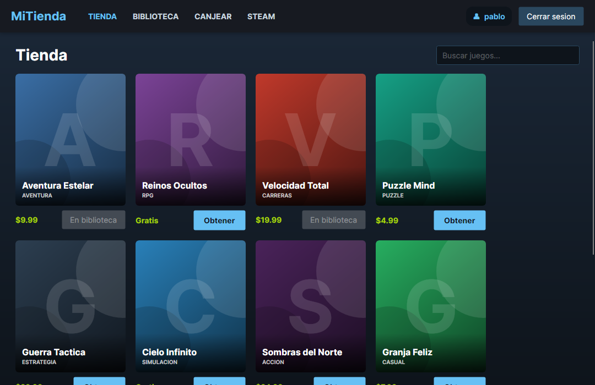
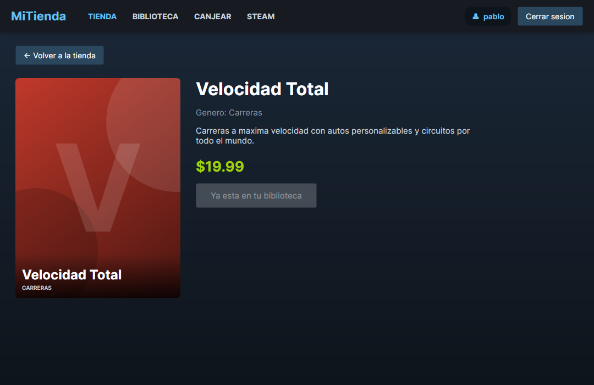
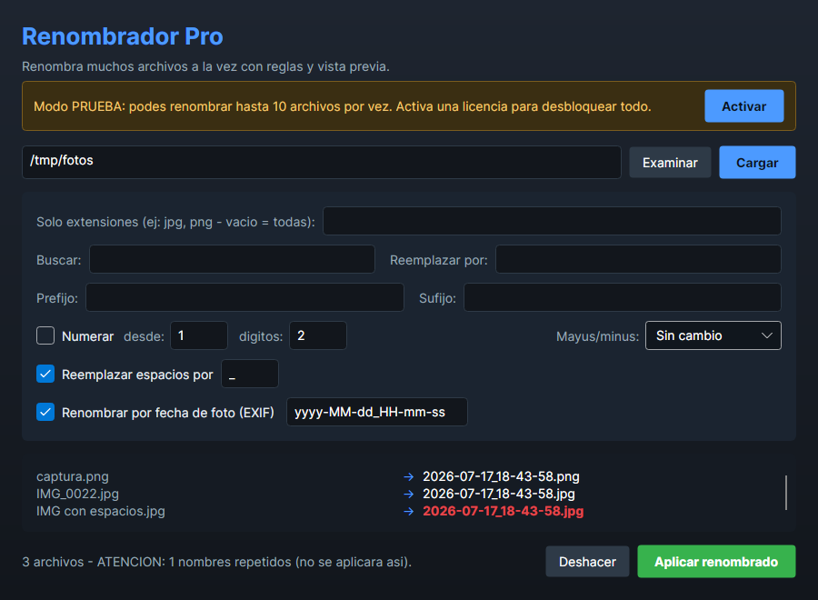

# Plataforma de Licencias y Tienda de Juegos

Colección de proyectos en **C# / .NET 10** construidos alrededor de un mismo eje: la
**protección de software con licencias de firma digital**. Va desde una herramienta de consola
hasta una tienda de escritorio completa, un SDK reutilizable y un producto real listo para vender.

> Proyecto personal de aprendizaje. Todo el código es propio.

---

## ¿Qué hay adentro?

| Proyecto | Qué es |
|----------|--------|
| **`Nucleo/`** | Librería compartida: licencias (ECDSA), cuentas con contraseñas hasheadas, biblioteca de juegos, base de datos SQLite y cliente de la API oficial de Steam. |
| **`AppEscritorio/`** | Tienda de juegos de escritorio estilo Steam (Avalonia): login, tienda, biblioteca, canje de licencias y panel de administrador. |
| **`LicenciaKit/`** | SDK independiente y sin dependencias para generar y validar licencias en cualquier programa .NET. |
| **`Herramientas/`** | Generador de licencias (vendedor) + app de ejemplo que integra el SDK. |
| **`Renombrador/`** | Producto propio y vendible: un renombrador masivo de archivos, protegido con licencias, con su landing page. |
| **`proyecto final/`** | Herramienta de consola (emisor de licencias + utilidades de Steam) y el sistema original de **tarjeta SUBE** que dio origen al repo. |

---

## Capturas

**Tienda de escritorio (estilo Steam)**



**Ficha de un juego**



**Renombrador Pro (producto vendible)**



---

## Lo que demuestra técnicamente

- **Criptografía aplicada:** firma digital **ECDSA P-256** para licencias infalsificables;
  contraseñas con **PBKDF2 + salt** (nunca en texto plano).
- **Separación de roles:** el emisor tiene la clave privada; el cliente solo la pública y puede
  validar pero no generar.
- **Arquitectura limpia:** lógica compartida en una librería, sin duplicar código entre apps.
- **Base de datos:** persistencia en **SQLite** con migración automática desde archivos de texto.
- **Interfaz de escritorio:** **Avalonia** (multiplataforma), tema oscuro, vistas dinámicas.
- **Integración con API real:** consumo de la **Steam Web API** (solo lectura).
- **Producto completo:** desde la lógica hasta el empaquetado en un `.exe` autocontenido y su
  página de venta.

## Tecnologías

`C#` · `.NET 10` · `Avalonia` · `SQLite (Microsoft.Data.Sqlite)` · `ECDSA / PBKDF2` ·
`MetadataExtractor (EXIF)` · `HTML/CSS/JS` (landing)

---

## Cómo correrlo

Requiere el **SDK de .NET 10**.

```bash
# Tienda de escritorio estilo Steam
cd AppEscritorio && dotnet run

# Renombrador Pro (producto)
cd Renombrador && dotnet run

# Herramienta de consola (emisor de licencias + Steam)
cd "proyecto final" && dotnet run
```

Más detalle de la arquitectura en [`ARQUITECTURA.md`](ARQUITECTURA.md). Cada producto tiene su
propio README (ver `Renombrador/` y `LicenciaKit/`).

---

## Nota sobre datos y seguridad

Las claves privadas, cuentas y bases de datos se guardan **fuera del repositorio** (en la carpeta
de datos del usuario) y están excluidas por `.gitignore`. Nada sensible se versiona.
